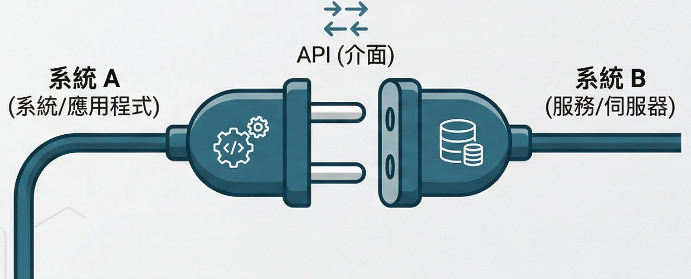

# 以自己為圓心的影響力-科技老師競爭力 Upgrade
## 實作工作坊 - API 的概念與串接實作
### Joannie Huang 2026.04.07 
<!-- _paginate: false -->
---

# 基本認識

## API (Application Programming Interface) 是什麼？
### 從生活到 AI 時代，一個概念改變了世界

---

# 先從一個問題開始

## 你一定有以下經驗

- 在餐廳 App 訂位，卻能用 **Google 帳號登入**
- 在蝦皮結帳，可以看到 **7-11 門市地圖** 選取離家最近的店面
- 問 ChatGPT 問題，它竟然知道**今天的天氣資訊**

---

# 這背後都是 API 在運作

## API 的白話文解釋

> **API = 程式與程式之間的「服務員」**

你（App）點餐 → 服務員（API）傳遞需求 → 廚房（另一個系統）回傳結果

| 角色 | 現實比喻 | 技術對應 |
|------|----------|----------|
| 你 | 客人點餐 | 你的 App / 網站 |
| 服務員 | 傳遞需求與回應 | API |
| 廚房 | 處理並回傳資料 | 另一個系統或資料庫 |

---

---

---
# 思考：API 到底是什麼？

---
# 生活中的 API 無所不在

## 你每天都在用，只是不知道

- **Google 地圖** 嵌入到各種 App → Google Maps API
- **Line Pay / 信用卡刷卡** → 金流 API
- **天氣預報顯示在桌面** → 氣象 API
- **用 Facebook 登入各種網站** → 社群登入 API

---

# 網路時代：API 讓資料開始「流動」

## 2000 年代：資料孤島 → 資料互通

**以前：** 每個系統各自為政，資料鎖在裡面

## 有了 API 之後：

- 不同系統可以**互相溝通**，資料不再孤立
- 開發者不需重新造輪子，直接**串接現有服務**
- 一個產品可以整合地圖、金流、天氣、登入……**數十種能力**
- 催生了 **App 經濟**：Uber、Airbnb、Line 都建立在別人的 API 上

---

# 他們都站在別人的肩膀上

## Uber、Airbnb、LINE 背後串接了哪些 API？

  

    <h3>🚗&nbsp;&nbsp;&nbsp;Uber</h3>
    <ul>
      <li>Google Maps API 顯示地圖、計算路線</li>
      <li>Twilio SMS API 簡訊驗證與行程通知</li>
      <li>Stripe API 信用卡付款金流</li>
    </ul>
  

  

    <h3>🏠&nbsp;&nbsp;&nbsp;Airbnb</h3>
    <ul>
      <li>Google Maps API 房源位置與周邊地圖</li>
      <li>Twilio API 訂房確認與客服通知</li>
      <li>PayPal / Stripe API 跨國付款與房東收款</li>
    </ul>
  

  

    <h3>💬&nbsp;&nbsp;&nbsp;LINE</h3>
    <ul>
      <li>Apple / Google 登入 API 第三方帳號快速登入</li>
      <li>電信商 SMS API 手機號碼驗證註冊</li>
      <li>銀行金流 API LINE Pay 串接帳戶與信用卡</li>
    </ul>
  

💡 這些公司的「核心價值」是自己的產品邏輯，但大量的基礎功能都來自 API 串接。

---

# API 讓資料自由流動，誰受益最多？

## 大公司 vs 小公司的不同優勢

  

    <h3>🏢&nbsp;&nbsp;&nbsp;大公司：開放 API，建立生態系</h3>
    <ul>
      <li>將自身資料與服務「對外開放」，吸引第三方開發者串接</li>
      <li>越多人用，平台價值越高（網路效應）</li>
      <li>不需自己做所有功能，讓外部開發者擴充產品</li>
      <li>範例：Google Maps、Facebook Login、Stripe</li>
    </ul>
  

  

    <h3>🚀&nbsp;&nbsp;&nbsp;小公司：串接 API，快速成長</h3>
    <ul>
      <li>不用從零建基礎設施，直接站在大公司肩膀上</li>
      <li>用少量人力就能整合地圖、金流、簡訊等複雜功能</li>
      <li>專注在核心產品，而非重複造輪子</li>
      <li>範例：新創 App 一週內上線完整付款與地圖功能</li>
    </ul>
  

💡 API 讓大公司的資源變成小公司的養分，整個產業一起加速。

---

# 🚌 小任務：如果你是開發者

## 這個 App 需要串接哪些 API？

  

    
    
<strong>Bus+</strong> 公車動態、臺鐵 Ubike 查詢

  

  

    <h3>📋&nbsp;&nbsp;&nbsp;任務說明</h3>
    
假設你要自己開發這款 App，請到以下資源搜尋看看，你覺得需要串接哪些 API？找到越多、找到實際網路資源越好！

    <ul>
      <li>🔗&nbsp;&nbsp;&nbsp;<strong>台北市開放資料平台</strong>：<a href="https://data.taipei">data.taipei</a></li>
      <li>🔗&nbsp;&nbsp;&nbsp;<strong>政府資料開放平臺</strong>：<a href="https://data.gov.tw">data.gov.tw</a></li>
      <li>🔗&nbsp;&nbsp;&nbsp;<strong>PTX 運輸資料流通服務</strong>：<a href="https://tdx.transportdata.tw">tdx.transportdata.tw</a></li>
    </ul>
    

      💡 提示：可能會用到 Google Maps API、公車動態 API、YouBike 即時資料 API、臺鐵時刻 API……你還能找到哪些？
    

  

---

# 什麼是 Web API？

## 透過網路呼叫的 API

  

    <h3>📖&nbsp;&nbsp;&nbsp;定義</h3>
    <ul>
      <li>Web API 是透過<strong>網路（HTTP）</strong>來呼叫的 API</li>
      <li>你送出一個「請求（Request）」</li>
      <li>對方回傳一筆「資料（Response）」</li>
      <li>通常資料格式是 <strong>JSON</strong></li>
    </ul>
  

  

    <h3>🌐&nbsp;&nbsp;&nbsp;生活比喻</h3>
    <ul>
      <li>就像在瀏覽器打開一個網址</li>
      <li>但回傳的不是網頁，而是<strong>純資料</strong></li>
      <li>程式讀這筆資料，再顯示成你看到的畫面</li>
      <li>App、網站背後大量使用這個方式</li>
    </ul>
  

  你的程式　→　發出 HTTP 請求（URL）　→　Web API 伺服器　→　回傳 JSON 資料　→　你的程式解讀並顯示

---

# 來看一個真實的 Web API

## 台北市政府開放資料：臺北捷運車站出口公車資訊

🔗 直接在瀏覽器打開這個網址，就能看到 API 回傳的資料：

<a href="https://data.taipei/api/v1/dataset/21a42190-91be-4921-96a7-f564c50a270d?scope=resourceAquire" style="color: #1565C0;">https://data.taipei/api/v1/dataset/21a42190-91be-4921-96a7-f564c50a270d?scope=resourceAquire</a>

  

    <h3>📦&nbsp;&nbsp;&nbsp;回傳資料長這樣（JSON）</h3>
    <ul>
      <li><code>count: 5620</code>：共有 5620 筆資料</li>
      <li><code>limit: 20</code>：這次回傳 20 筆</li>
      <li><code>offset: 0</code>：從第 0 筆開始</li>
      <li><code>車站: "松山機場"</code>：捷運站名稱</li>
      <li><code>出口: "出口1"</code>：出口編號</li>
      <li><code>公車名稱: "1841-松山機場"</code>：公車路線</li>
      <li><code>最後更新日期: "20250602"</code>：資料更新時間</li>
    </ul>
  

  

    <h3>🛠&nbsp;&nbsp;&nbsp;呼叫這個 API 需要什麼？</h3>
    <ul>
      <li>一個 <strong>URL（端點 Endpoint）</strong></li>
      <li>指定 <strong>參數</strong>（如 <code>scope=resourceAquire</code>）</li>
      <li>此 API 為公開資料，<strong>不需要 API Key</strong></li>
      <li>用瀏覽器、程式、或工具（如 Postman）都能呼叫</li>
    </ul>
  

---

# 呼叫 Web API 需要什麼？

## 三個核心要素

  

    <h3>1️⃣&nbsp;&nbsp;Endpoint（端點 URL）</h3>
    <ul>
      <li>API 的「地址」</li>
      <li>就是你要呼叫的網址</li>
      <li>不同功能有不同的 URL</li>
      <li>例：<code>data.taipei/api/v1/...</code></li>
    </ul>
  

  

    <h3>2️⃣&nbsp;&nbsp;參數（Parameters）</h3>
    <ul>
      <li>附加在 URL 後的篩選條件</li>
      <li>用 <code>?key=value</code> 格式傳入</li>
      <li>告訴 API 你要哪些資料</li>
      <li>例：<code>?scope=resourceAquire</code></li>
    </ul>
  

  

    <h3>3️⃣&nbsp;&nbsp;API Key（金鑰）</h3>
    <ul>
      <li>許多 API 需要「身份證明」</li>
      <li>申請後取得一組專屬代碼</li>
      <li>用來防止濫用、追蹤用量</li>
      <li>例：<code>?key=AbCd1234XyZ</code></li>
    </ul>
  

---

# 什麼是 API Key？

## 你的專屬通行證

  

    <h3>🔑&nbsp;&nbsp;&nbsp; API Key 是什麼？</h3>
    <ul>
      <li>一組由平台發給你的<strong>專屬字串</strong></li>
      <li>每次呼叫 API 時附上，代表「是我在呼叫」</li>
      <li>平台用它識別你的身份、限制使用量</li>
      <li>常見於：Google Maps、OpenAI、天氣 API 等</li>
    </ul>
  

  

    <h3>📋 &nbsp;&nbsp;&nbsp;取得與使用流程</h3>
    <ul>
      <li>1️⃣&nbsp;&nbsp;&nbsp; 到平台網站<strong>註冊帳號</strong></li>
      <li>2️⃣&nbsp;&nbsp;&nbsp; 建立專案，申請 API Key</li>
      <li>3️⃣&nbsp;&nbsp;&nbsp; 將 Key 加入你的 API 請求中</li>
      <li>4️⃣&nbsp;&nbsp;&nbsp; 平台驗證 → 回傳資料</li>
    </ul>
  

  ⚠️&nbsp;&nbsp;&nbsp; API Key 等於你的密碼，<strong>不可公開、不可上傳到 GitHub (公開平台/社群媒體)</strong>。一旦洩漏，別人可以用你的配額呼叫 API，甚至產生費用！

---

# 思考：API 在 AI 時代有什麼重要
---

# AI 時代，API 為何變得更重要？

## 數字說話

  

    
807%

    
2023→2024 年間 AI 相關 API 使用量成長

  

  

    
1,000+

    
現在平均每間企業 管理的 API 數量

  

  

    
22 → 42

    
單一 API 的平均端點數 一年內翻倍（為了支援 AI）

  

  💡 幾乎每一次 AI 互動——從 ChatGPT 查詢到 AI Agent 自動執行任務——背後都是一次 API 呼叫。<strong>AI 讓 API 的重要性從「工具」升級為「基礎建設」。</strong>

資料來源：<a href="https://nordicapis.com/shift-to-ai-exploded-api-usage-in-2024/">Nordic APIs — Shift to AI Exploded API Usage in 2024</a>

---

# AI 如何透過 API 採取行動？

## 從「回答問題」到「完成任務」

  

    
👤 使用者下指令

    
→

    
🧠 AI 理解意圖

    
→

    
🔧 決定呼叫哪個 API

    
→

    
📡 送出 API 請求

    
→

    
✅ 取得結果並回應

  

  

    <h3>🤖&nbsp;&nbsp;&nbsp;舊：AI 只能「說」</h3>
    <ul>
      <li>只能用文字回答問題</li>
      <li>無法存取即時資料</li>
      <li>無法操作外部系統</li>
      <li>每件事都要人來執行</li>
    </ul>
  

  

    <h3>🚀&nbsp;&nbsp;&nbsp;新：AI Agent 能「做」</h3>
    <ul>
      <li>透過 API 查詢即時資訊</li>
      <li>自動訂票、傳訊息、寫程式</li>
      <li>串接多個 API 完成複雜任務</li>
      <li>人只需給目標，AI 自己規劃步驟</li>
    </ul>
  

參考：<a href="https://treblle.com/blog/api-guide-for-ai-agents">Treblle — How APIs Power AI Agents</a>　｜　<a href="https://www.anthropic.com/research/building-effective-agents">Anthropic — Building Effective Agents</a>

---

# AI Agent 實際案例：API 串接的威力

## 一個指令，背後多少 API 在運作？

  💬 使用者說：「幫我安排下週五去台北的行程，預訂火車票和飯店，並加進我的行事曆。」

  

    <h3>🚂&nbsp;&nbsp;&nbsp;交通</h3>
    <ul>
      <li>台鐵 / 高鐵 API 查詢班次與票價</li>
      <li>自動完成訂票</li>
    </ul>
  

  

    <h3>🏨&nbsp;&nbsp;&nbsp;住宿</h3>
    <ul>
      <li>Booking.com API 搜尋可用飯店</li>
      <li>金流 API 完成付款</li>
    </ul>
  

  

    <h3>📅&nbsp;&nbsp;&nbsp;行程</h3>
    <ul>
      <li>Google Calendar API 新增行程提醒</li>
      <li>Google Maps API 確認地點與路線</li>
    </ul>
  

延伸閱讀：<a href="https://www.merge.dev/blog/api-for-ai-agents">Merge.dev — APIs for AI Agents: What You Should Know</a>　｜　<a href="https://composio.dev/content/apis-ai-agents-integration-patterns">Composio — APIs for AI Agents: The 5 Integration Patterns</a>

---

# 為什麼老師也需要理解這件事？

## API 正在重新定義「會用 AI」的邊界

  

    <h3>🎓&nbsp;&nbsp;&nbsp;對教育者的意義</h3>
    <ul>
      <li>未來學生會用 AI Agent 完成各種任務</li>
      <li>理解 API = 理解 AI 的「手腳」怎麼運作</li>
      <li>能設計讓學生串接 API 的專題任務</li>
      <li>不只「使用」AI，而是「指揮」AI</li>
    </ul>
  

  

    <h3>🔮&nbsp;&nbsp;&nbsp;正在發生的趨勢</h3>
    <ul>
      <li>AI 將成為最大的 API 消費者</li>
      <li>MCP（Model Context Protocol）讓 AI 自動發現並呼叫 API</li>
      <li>未來 App 不是「人在用」，而是「AI 在呼叫」</li>
      <li>API 設計開始為 AI 而非人類優化</li>
    </ul>
  

  "AI applications demand APIs to be designed for machine consumers, not just human developers." 
  — SmartBear, <a href="https://smartbear.com/blog/why-api-first-matters-in-an-ai-driven-world/">Why API-First Matters in an AI-Driven World</a>

---
# 實作練習: 感受 API 串接的魔力

---

# 🛠 實作時間：打造你的第一個 API 串接工具

## 今天要做什麼？

  🎯&nbsp;&nbsp;&nbsp;目標：用 <strong>AI 幫你寫程式</strong>，完成一個 LINE 機器人—— 
  傳訊息給它，它就幫你把事情新增到 <strong>Google 行事曆</strong>

  

    <h3>🔧&nbsp;&nbsp;&nbsp;你需要準備</h3>
    <ul>
      <li>Google 帳號（有 Google Calendar）</li>
      <li>LINE 帳號（手機可收訊息）</li>
      <li>ChatGPT 或 Gemini 帳號</li>
      <li>瀏覽器（Chrome 建議）</li>
    </ul>
  

  

    <h3>⚙️&nbsp;&nbsp;&nbsp;會用到的服務</h3>
    <ul>
      <li>LINE Developers Console（建 bot）</li>
      <li>Google Apps Script（寫程式）</li>
      <li>Google Calendar API（新增行程）</li>
      <li>ChatGPT / Gemini（幫你寫程式碼）</li>
    </ul>
  

  

    <h3>🗺️&nbsp;&nbsp;&nbsp;流程概覽</h3>
    <ul>
      <li>① 建立 LINE bot</li>
      <li>② 開啟 Google Apps Script</li>
      <li>③ 請 AI 幫你寫程式</li>
      <li>④ 串接 Webhook，測試！</li>
    </ul>
  

⏱ 預計完成時間：30–40 分鐘　｜　不需要任何程式基礎，AI 會幫你寫！

---

# 第一步：建立 LINE Bot

## 到 LINE Developers 申請你的機器人

  

    
1

    
前往 <strong><a href="https://developers.line.biz">developers.line.biz</a></strong>，用 LINE 帳號登入

  

  

    
2

    
建立 <strong>Provider</strong>（可取你的名字），再建立一個 <strong>Messaging API channel</strong>

  

  

    
3

    
進入 channel 設定，找到 <strong>Channel access token</strong>，按「Issue」取得 token，複製並記下來

  

  

    
4

    
在 <strong>Messaging API</strong> 頁籤，關閉「Auto-reply messages」，開啟「Use webhook」（Webhook URL 先留空，等等填）

  

  

    
5

    
用手機掃描 QR Code，將自己加為 bot 的好友

  

  📌&nbsp;&nbsp;&nbsp;記下這兩個東西：<strong>Channel access token</strong>　｜　<strong>Channel secret</strong>（在 Basic settings 頁籤）

---

# 第二步：請 AI 幫你寫程式

## 打開 ChatGPT 或 Gemini，告訴它你的需求

  
😩&nbsp;&nbsp;痛點

  
每次有人跟我約時間，都要自己打開 Google 日曆手動新增。我想要一個 LINE 工具，可以複製貼上別人傳來的訊息，或是直接打： 
  <strong>「明天中午跟人約在中正國中討論課程」</strong>——它就自動幫我建行程。

**🔑&nbsp;&nbsp;關鍵字（把這些告訴 AI）**

  Google Apps Script
  LINE Chatbot
  Google Calendar
  ⊕ Gemini API（選用）

💬&nbsp;&nbsp;剩下的，用你自己的話跟 AI 說清楚你要什麼——這本身就是一種能力的練習。

---

# 第三步：部署並串接 Webhook

## 讓 LINE 知道要把訊息送到哪裡

  

    
1

    
在 Google Apps Script，點選上方 <strong>部署 → 新增部署</strong>

  

  

    
2

    
類型選 <strong>網頁應用程式</strong>，執行身分選「我」，存取權選 <strong>「所有人」</strong>，按部署

  

  

    
3

    
複製部署後產生的 <strong>網頁應用程式 URL</strong>（長得像 script.google.com/macros/s/...）

  

  

    
4

    
回到 LINE Developers，將這個 URL 貼到 <strong>Webhook URL</strong> 欄位，按「Verify」確認連線成功

  

  

    
5

    
打開手機，傳訊息給你的 LINE bot，例如：<strong>「明天下午開會」</strong>，看看行事曆有沒有出現！

  

  ⚠️&nbsp;&nbsp;&nbsp;如果 Verify 失敗或訊息沒有回應，把 GAS 的「執行記錄」截圖，貼給 AI 請它幫你除錯！

---

# 完成了！接下來可以做什麼？

## 恭喜你完成第一個 AI × API 串接工具 🎉

  

    <h3>🚀&nbsp;&nbsp;&nbsp;進階挑戰（如果還有時間）</h3>
    <ul>
      <li>讓 bot 可以指定日期（「下週五開會」）</li>
      <li>加入時間提醒（「明天下午 3 點」）</li>
      <li>讓 bot 回傳當天的行事曆清單</li>
      <li>把 prompt 改成繁體中文版，重新請 AI 優化</li>
    </ul>
  

  

    <h3>💬&nbsp;&nbsp;&nbsp;反思：你剛才做了什麼？</h3>
    <ul>
      <li>用 <strong>LINE API</strong> 接收使用者訊息</li>
      <li>用 <strong>Google Calendar API</strong> 新增行程</li>
      <li>用 <strong>AI</strong> 幫你把兩個 API 串接起來</li>
      <li>你沒有從零寫程式，但你<strong>指揮了 AI</strong> 完成它</li>
    </ul>
  

  🔑&nbsp;&nbsp;&nbsp;這就是 API 的力量：<strong>不需要自己造輪子</strong>，用對工具、問對問題，任何人都可以打造自己的小工具。

---

# 延伸思考與嘗試

## 完成後，你還可以繼續玩——

  

    <h3>🔍&nbsp;&nbsp;&nbsp;看懂程式，就能改動它</h3>
    <ul>
      <li>找到 <code>CHANNEL_ACCESS_TOKEN</code> 和 <code>CALENDAR_ID</code>——這就是你能改的地方</li>
      <li>看到 <code>event.title =</code> 或 <code>startTime</code>，試著改改看預設值</li>
      <li>請 AI 幫你「加上一行，讓回覆訊息更友善」</li>
    </ul>
  

  

    <h3>🤖&nbsp;&nbsp;&nbsp;Gemini API 可以幫什麼？</h3>
    <ul>
      <li>讓 AI 從自然語言中「理解」時間與地點</li>
      <li>例：「下週三下午三點」→ 自動轉成正確日期格式</li>
      <li>例：「跟小明約在信義區」→ 抓出地點欄位</li>
      <li>把 Gemini 加進流程，讓 bot 更聰明</li>
    </ul>
  

---

# 延伸思考與嘗試（續）

  

    <h3>📍&nbsp;&nbsp;&nbsp;讓地點與時間更精準</h3>
    <ul>
      <li>試著請 AI 加入「地點」欄位，寫入 Google Calendar 的 location</li>
      <li>測試「明天下午兩點到四點」——連續時間能正確抓嗎？</li>
      <li>如果不行，把錯誤貼給 AI，讓它改進解析邏輯</li>
    </ul>
  

  

    <h3>🧪&nbsp;&nbsp;&nbsp;測試模式：它真的懂你嗎？</h3>
    <ul>
      <li>試傳不同格式的訊息給 bot，看它怎麼反應</li>
      <li>「這禮拜五早上九點開會」✓ or ✗？</li>
      <li>「下下週一跟校長討論課程」✓ or ✗？</li>
      <li>把失敗案例交給 AI 改進，記錄你的測試結果</li>
    </ul>
  

---

# 體驗結束：反思與課程設計的思考

## API ＋ 真實資料，可以進你的課堂嗎？

  💡&nbsp;&nbsp;&nbsp;網路上有大量<strong>公開 API 與開放資料庫</strong>，不需要程式能力，只要知道「資料在哪裡」，就能設計出讓學生接觸<strong>真實世界</strong>的探究任務。

| 領域 | 探究主題 / 議題 | 可用的 API 或資料來源 | 學生能做什麼？ |
|------|--------------|------------------|-------------|
| 📖 國文 | 新聞語言與媒體識讀 | 中央社開放新聞 API、Google News | 分析同一事件不同媒體的用字與立場 |
| ➕ 數學 | 統計與生活數據 | 政府開放資料平台（data.gov.tw）空氣品質、人口資料 | 用真實數據畫折線圖、做統計推論 |
| 🔤 英文 | 全球氣候變遷報導 | OpenWeatherMap API、NASA 開放資料 | 閱讀英文資料，撰寫氣候觀察報告 |
| 💻 資訊 | 資料視覺化與 API 串接 | 任何公開 REST API（YouBike、空氣品質） | 設計小程式，將資料呈現為圖表或地圖 |
| 🔧 生活科技 | 智慧城市與物聯網 | 台北市感測資料、交通部 TDX | 探討感測器資料如何驅動城市決策 |

---

# 不同領域的課程設計範例

## 從「真實資料」出發的探究任務

  

    
📖 國文

    <h3>媒體報導，誰說了什麼？</h3>
    <ul>
      <li>用新聞 API 抓取同一天不同媒體的標題</li>
      <li>學生分析：關鍵詞、情緒、立場差異</li>
      <li>討論：語言如何影響讀者的判斷？</li>
      <li>產出：一份媒體識讀觀察報告</li>
    </ul>
  

  

    
➕ 數學

    <h3>空氣品質，數字說了什麼？</h3>
    <ul>
      <li>從環保署 API 取得各地 AQI 即時數值</li>
      <li>學生計算平均、標準差、做折線圖</li>
      <li>比較不同城市或季節的差異</li>
      <li>產出：數據圖表＋一頁分析說明</li>
    </ul>
  

  

    
🔤 英文

    <h3>氣候數據，用英文說故事</h3>
    <ul>
      <li>閱讀 NASA 或 NOAA 的英文氣候報告</li>
      <li>搭配 OpenWeatherMap API 看台灣資料</li>
      <li>用英文撰寫「我城市的氣候觀察」</li>
      <li>產出：英文短文或口頭報告</li>
    </ul>
  

---

# 換你想想看

## 你的課，可以連結哪一筆真實資料？

  
我教的是 ，我想讓學生探究的議題是 。

  
我可以找到的真實資料來源是 ，

  
學生可以用這筆資料來 ，最後產出 。

  

    <h3>🔗&nbsp;&nbsp;推薦資料來源</h3>
    <ul>
      <li><a href="https://data.gov.tw">data.gov.tw</a>　政府資料開放平台</li>
      <li><a href="https://data.taipei">data.taipei</a>　台北市開放資料</li>
      <li><a href="https://tdx.transportdata.tw">tdx.transportdata.tw</a>　交通資料</li>
      <li><a href="https://openweathermap.org/api">openweathermap.org/api</a>　天氣</li>
    </ul>
  

  

    <h3>💬&nbsp;&nbsp;可以問 AI 的問題</h3>
    <ul>
      <li>「我是＿＿老師，有沒有適合用在課堂的開放 API？」</li>
      <li>「請幫我設計一個用真實資料的探究學習任務」</li>
      <li>「這筆資料學生可以做什麼分析？」</li>
    </ul>
  

